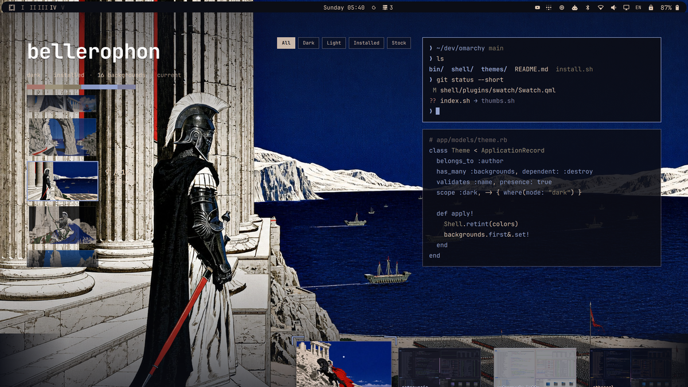
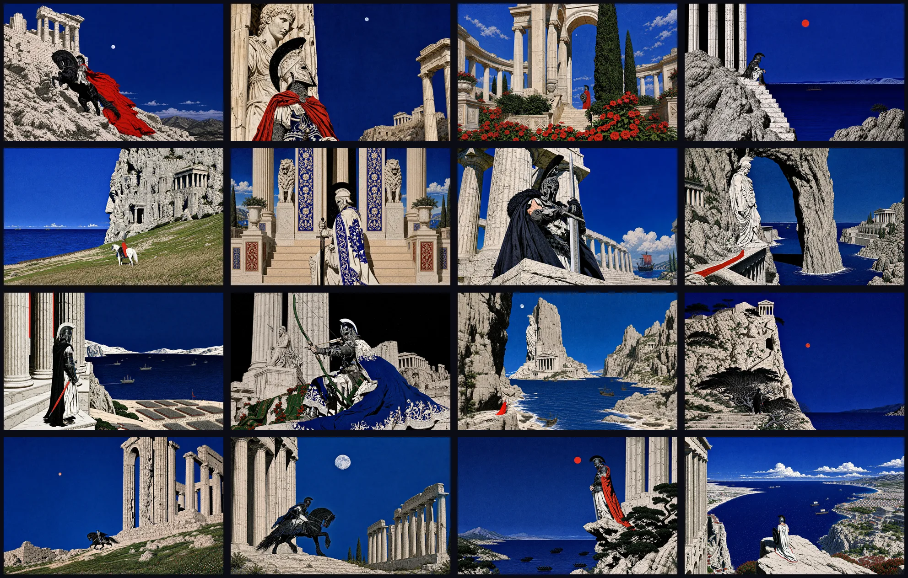
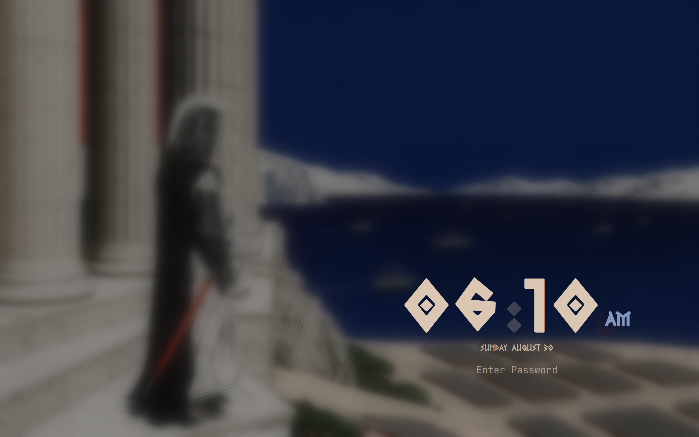
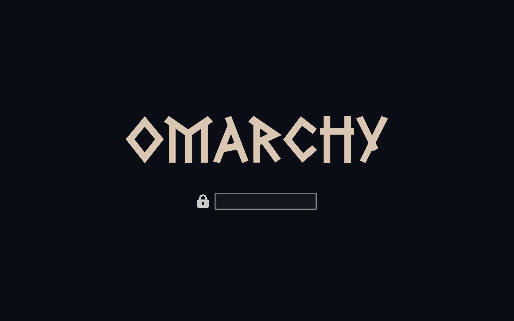

# Bellerophon for Omarchy



A dark [Omarchy](https://omarchy.org/) theme inspired by Bellerophon and Greek
mythology. Deep Aegean blue, marble, weathered bronze, and restrained red
accents carry across the desktop, terminal, editor, and shell.

## Install

Open the Omarchy menu with `Super + Space`, choose
**Install > Style > Theme**, and paste:

```text
https://github.com/janooh37-hue/omarchy-bellerophon-theme.git
```

Or install it from a terminal:

```sh
omarchy theme install https://github.com/janooh37-hue/omarchy-bellerophon-theme.git
```

Cycle through the included wallpapers with:

```sh
omarchy theme bg next
```

## Wallpapers



Shown left to right, top to bottom in filename order from `01` through `16`.

## Included

- An Aether-generated dark palette for Omarchy v4
- Sixteen 2880×1800 illustrated wallpapers
- Disk-unlock and screensaver artwork
- Passive theme assets only—no Lua, terminal configuration, or `vscode.json`

Omarchy safely generates application and terminal configuration from
`colors.toml` when the theme is installed.

## Lock and login previews

| Lock screen with clock | SDDM login preview |
| --- | --- |
|  |  |

The lock screen uses the optional
[Lock Style](https://github.com/MrDemonc/Omarchy-lock-style) plugin. The SDDM
image shows a matching local greeter. These companion surfaces are pictured for
clarity; installing an Omarchy theme does not replace the system SDDM greeter.

## Wallpaper quality

The installable theme keeps every wallpaper at its original 2880×1800
resolution. The files are metadata-stripped WebP images encoded at quality 82,
following the Omarchy gallery maintainer's recommended command. Only the image
encoding changes; the dimensions are not reduced.

For archival, editing, or anyone who wants the exact lossless sources, download
the [v1.0.0 lossless PNG master pack](https://github.com/janooh37-hue/omarchy-bellerophon-theme/releases/download/v1.0.0/bellerophon-wallpapers-lossless.zip).
The large master pack is a separate release asset so routine theme installs
remain fast.

## Optional plugins shown in the preview

The screenshot shows the following active community plugins. They are linked
for anyone who wants to reproduce the desktop, but Bellerophon neither installs
nor requires them.

| Plugin | Repository |
| --- | --- |
| Floating Bar | [Charlieras262/omarchy-floating-bar](https://github.com/Charlieras262/omarchy-floating-bar) |
| Network Devices | [intrepid-developer/omarchy-network-devices](https://github.com/intrepid-developer/omarchy-network-devices) |
| YouTube Player | [brm-src/omarchy-youtube-player](https://github.com/brm-src/omarchy-youtube-player) |
| System Stats | [harbefas/omarchy-system-stats](https://github.com/harbefas/omarchy-system-stats) |
| Lock Style | [MrDemonc/Omarchy-lock-style](https://github.com/MrDemonc/Omarchy-lock-style) |
| Keybindings | [meviusisback/keybinds-plugin](https://github.com/meviusisback/keybinds-plugin) |
| Keyglow | [0x1ocean/omarchy-keyglow](https://github.com/0x1ocean/omarchy-keyglow) |
| Omaland | [bobby-nicholas/omaland](https://github.com/bobby-nicholas/omaland) |
| Swatch | [jmckible/omarchy-swatch](https://github.com/jmckible/omarchy-swatch) |
| Powerwave | [sjgng/omarchy-powerwave-plugin](https://github.com/sjgng/omarchy-powerwave-plugin) |

The workspace indicator in the screenshot is a user clone of Omarchy's built-in
Workspaces plugin, so it is not an additional dependency.

## License

The theme and included artwork are available under the [MIT License](LICENSE).
